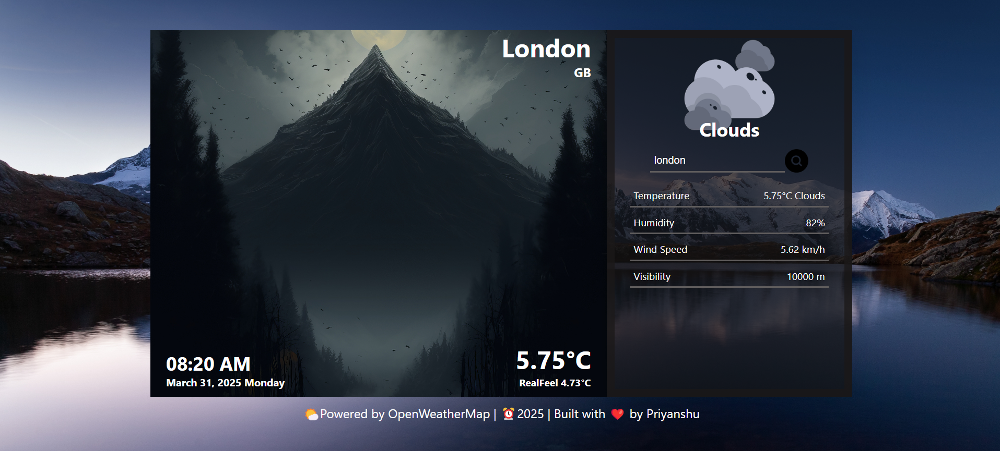

# React Weather App

## 📌 Overview
This is a React-based weather application that fetches and displays real-time weather information based on user input. The app provides details like temperature, humidity, and weather conditions, making it easy to stay updated on the weather.

# 🚀 Live Demo
🔗 [Try the Website Here](https://weather-app-by-priyanshu.netlify.app/)

## 🎨 Features
- **City Search** – Users can search for any city to get real-time weather updates.
- **Dynamic Icons & Backgrounds** – Changes based on current weather conditions.
- **Error Handling** – Alerts when the city is not found or any API error occurs.
- **Responsive Design** – Optimized for mobile, tablet, and desktop devices.

## 🛠️ Technologies Used
- **ReactJs** – Structuring the content and  for building the UI..
- **CSS3** – Styling and responsiveness.
- **JavaScript (ES6+)** – For adding interactivity and API handling.
- **OpenWeatherMap API** – For fetching weather data.
- **Axios** – For making API requests.
- **React Hooks** – For managing state and lifecycle.
- **Git/GitHub** – For version control.
- **Toast** - For alerts.


## 📂 Folder Structure
```
/react-weather-app
├── /public
├── /src
│   ├── App.css
│   ├── index.css
│   ├── App.js
│   ├── index.js
├── /node_modules
├── package.json
└── README.md

```
## 📸 Screenshots



## 🚀 Getting Started
1. **Clone the Repository:**
   ```
   git clone https://github.com/your-username/react-weather-app.git
   ```
2. **Navigate to the Project Directory**
```
   cd react-weather-app
```
3. **Install Dependencies**
```
   npm install
```
4. **Get API Key and weather api**
```
   Visit OpenWeatherMap API to get your API key.
```
5. **Run the Application**
```
   npm start
```


---
⭐ Feel free to contribute or suggest improvements!